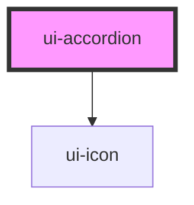

# ui-accordion

<!-- Auto Generated Below -->

## Properties

| Property                | Attribute                 | Description                                                                                                          | Type      | Default     |
| ----------------------- | ------------------------- | -------------------------------------------------------------------------------------------------------------------- | --------- | ----------- |
| `accessibleDescribedBy` | `accessible-described-by` | Specifies the id or a string of space seperated ids of a component(s) that describes the accordion when is expanded. | `string`  | `undefined` |
| `expanded`              | `expanded`                | Specifies if accordion is expanded                                                                                   | `boolean` | `false`     |
| `hideArrow`             | `hide-arrow`              | Specifies if hide arrow                                                                                              | `boolean` | `false`     |

## Events

| Event                  | Description                                                     | Type                |
| ---------------------- | --------------------------------------------------------------- | ------------------- |
| `pressAccordionHeader` | onPressAccordionHeader event. Emits when press accordion header | `CustomEvent<void>` |

## Dependencies

### Depends on

- [ui-icon](../icon)

### Graph

----------------------------------------------

*Built with [StencilJS](https://stenciljs.com/)*
