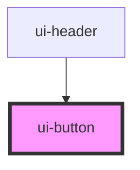

# ui-button

<!-- Auto Generated Below -->

## Properties

| Property          | Attribute          | Description                                                                         | Type                                     | Default     |
| ----------------- | ------------------ | ----------------------------------------------------------------------------------- | ---------------------------------------- | ----------- |
| `accessibleLabel` | `accessible-label` | Specifies the alternative text for screen readers                                   | `string`                                 | `undefined` |
| `disabled`        | `disabled`         | Specifies if button is disabled                                                     | `boolean`                                | `false`     |
| `linkHref`        | `link-href`        | Specifies the link reference. If the property is filled the `a` element is rendered | `string`                                 | `undefined` |
| `linkTarget`      | `link-target`      | Specifies the link target.                                                          | `string`                                 | `undefined` |
| `variant`         | `variant`          | Specifies the button variant                                                        | `"primary" \| "secondary" \| "tertiary"` | `'primary'` |

## Events

| Event   | Description                        | Type                |
| ------- | ---------------------------------- | ------------------- |
| `press` | Emitted when the button is pressed | `CustomEvent<void>` |

## Dependencies

### Used by

 - [ui-header](../../molecules/header)

### Graph

----------------------------------------------

*Built with [StencilJS](https://stenciljs.com/)*
