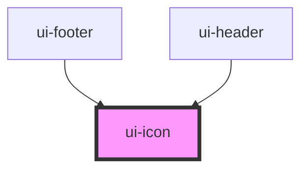

# ui-icon

<!-- Auto Generated Below -->

## Properties

| Property            | Attribute | Description                        | Type        | Default     |
| ------------------- | --------- | ---------------------------------- | ----------- | ----------- |
| `name` _(required)_ | `name`    | Specifies the icon name to display | `IconNames` | `undefined` |

## Dependencies

### Used by

 - [ui-footer](../../molecules/footer)
 - [ui-header](../../molecules/header)

### Graph

----------------------------------------------

*Built with [StencilJS](https://stenciljs.com/)*
