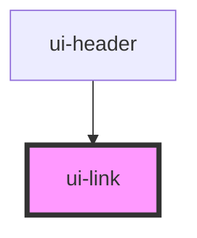

# ui-link

<!-- Auto Generated Below -->

## Properties

| Property          | Attribute          | Description                                                                                     | Type      | Default     |
| ----------------- | ------------------ | ----------------------------------------------------------------------------------------------- | --------- | ----------- |
| `accessibleLabel` | `accessible-label` | Specifies the alternative text of the link                                                      | `string`  | `undefined` |
| `smooth`          | `smooth`           | Specifies if the smooth effect should be enabled when url start with `#` (link to section page) | `boolean` | `false`     |
| `target`          | `target`           | Specifies where to open the linked document (_blank \| _self \| _parent \| _top \| framename)   | `string`  | `undefined` |
| `url`             | `url`              | Specifies a destination to link to, rendered in the href attribute of a link                    | `string`  | `undefined` |

## Events

| Event   | Description                      | Type                |
| ------- | -------------------------------- | ------------------- |
| `press` | Emitted when the link is pressed | `CustomEvent<void>` |

## Dependencies

### Used by

 - [ui-header](../../molecules/header)

### Graph

----------------------------------------------

*Built with [StencilJS](https://stenciljs.com/)*
