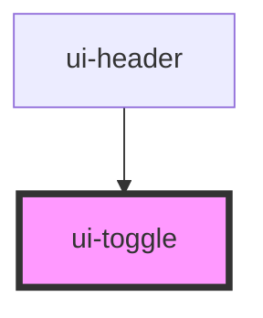

# ui-toggle

<!-- Auto Generated Below -->

## Properties

| Property          | Attribute          | Description                              | Type      | Default     |
| ----------------- | ------------------ | ---------------------------------------- | --------- | ----------- |
| `accessibleLabel` | `accessible-label` | Specifies an alternative text for toggle | `string`  | `undefined` |
| `checked`         | `checked`          | Specifies if input is checked            | `boolean` | `false`     |
| `disabled`        | `disabled`         | Specifies if input is disabled           | `boolean` | `false`     |
| `identifier`      | `identifier`       | Property description                     | `string`  | `undefined` |
| `name`            | `name`             | Specifies the input name                 | `string`  | `undefined` |
| `value`           | `value`            | Specifies the input value                | `string`  | `undefined` |

## Events

| Event               | Description                    | Type                            |
| ------------------- | ------------------------------ | ------------------------------- |
| `changeDetailEvent` | Emitted when the toggle change | `CustomEvent<CheckDetailEvent>` |

## Dependencies

### Used by

 - [ui-header](../../molecules/header)

### Graph

----------------------------------------------

*Built with [StencilJS](https://stenciljs.com/)*
