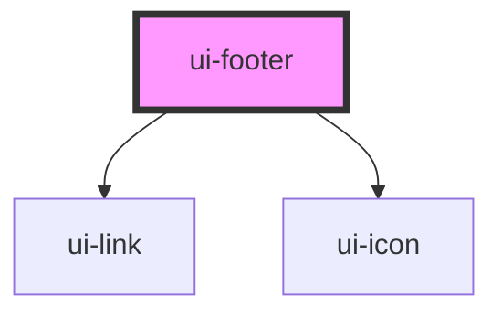

# ui-footer

<!-- Auto Generated Below -->

## Properties

| Property          | Attribute           | Description                                                  | Type     | Default     |
| ----------------- | ------------------- | ------------------------------------------------------------ | -------- | ----------- |
| `dataLinksSocial` | `data-links-social` | Specifies the navigation links as JSON string of `LinkModel` | `string` | `undefined` |
| `logoAlt`         | `logo-alt`          | Specifies the alternative text of logo image                 | `string` | `undefined` |
| `logoUrl`         | `logo-url`          | Specifies the logo image url                                 | `string` | `undefined` |

## Dependencies

### Depends on

- [ui-link](../../atoms/link)
- [ui-icon](../../atoms/icon)

### Graph

----------------------------------------------

*Built with [StencilJS](https://stenciljs.com/)*
