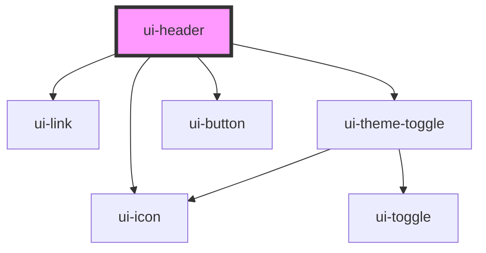

# ui-header

<!-- Auto Generated Below -->

## Properties

| Property                  | Attribute                    | Description                                                  | Type      | Default     |
| ------------------------- | ---------------------------- | ------------------------------------------------------------ | --------- | ----------- |
| `accesibleLabelMenu`      | `accesible-label-menu`       | Specifies the alternative text of menu button                | `string`  | `undefined` |
| `darkMode`                | `dark-mode`                  | Specifies if the dark mode is enabled                        | `boolean` | `false`     |
| `darkModeAccessibleLabel` | `dark-mode-accessible-label` | Specifies the alternative text for the dark mode label       | `string`  | `undefined` |
| `dataLinksSocial`         | `data-links-social`          | Specifies the navigation links as JSON string of `LinkModel` | `string`  | `undefined` |
| `expanded`                | `expanded`                   | Specifies if the menu mobile is expanded                     | `boolean` | `undefined` |
| `logoAlt`                 | `logo-alt`                   | Specifies the alternative text of logo image                 | `string`  | `undefined` |
| `logoUrl`                 | `logo-url`                   | Specifies the logo image url                                 | `string`  | `undefined` |

## Methods

### `closeMenu() => Promise<void>`

Close mobile menu

#### Returns

Type: `Promise<void>`

## Dependencies

### Depends on

- [ui-link](../../atoms/link)
- [ui-icon](../../atoms/icon)
- [ui-theme-toggle](../theme-toggle)
- [ui-button](../../atoms/button)

### Graph

----------------------------------------------

*Built with [StencilJS](https://stenciljs.com/)*
