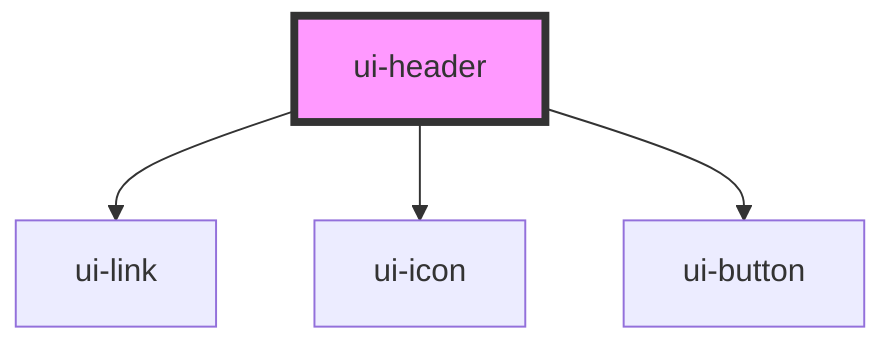

# ui-header

<!-- Auto Generated Below -->

## Properties

| Property             | Attribute              | Description                                                  | Type     | Default     |
| -------------------- | ---------------------- | ------------------------------------------------------------ | -------- | ----------- |
| `accesibleLabelMenu` | `accesible-label-menu` | Specifies the alternative text of menu button                | `string` | `undefined` |
| `dataLinks`          | `data-links`           | Specifies the navigation links as JSON string of `LinkModel` | `string` | `undefined` |
| `dataLinksSocial`    | `data-links-social`    | Specifies the navigation links as JSON string of `LinkModel` | `string` | `undefined` |
| `logoAlt`            | `logo-alt`             | Specifies the alternative text of logo image                 | `string` | `undefined` |
| `logoUrl`            | `logo-url`             | Specifies the logo image url                                 | `string` | `undefined` |

## Dependencies

### Depends on

- [ui-link](../../atoms/link)
- [ui-icon](../../atoms/icon)
- [ui-button](../../atoms/button)

### Graph

----------------------------------------------

*Built with [StencilJS](https://stenciljs.com/)*
