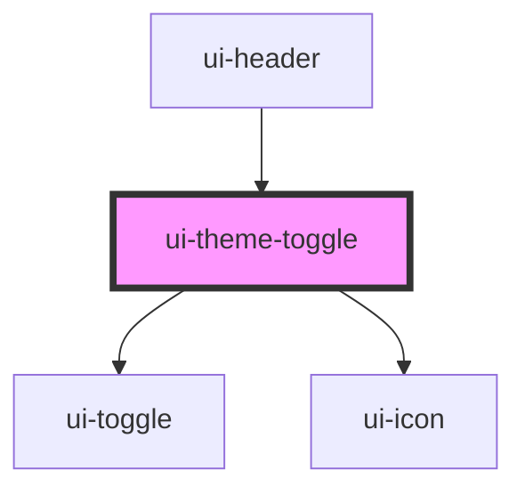

# ui-theme-toggle

<!-- Auto Generated Below -->

## Properties

| Property          | Attribute          | Description                              | Type      | Default     |
| ----------------- | ------------------ | ---------------------------------------- | --------- | ----------- |
| `accessibleLabel` | `accessible-label` | Specifies an alternative text for toggle | `string`  | `undefined` |
| `darkMode`        | `dark-mode`        | Specifies if dark mode is enabled        | `boolean` | `undefined` |

## Dependencies

### Used by

 - [ui-header](../header)

### Depends on

- [ui-toggle](../../atoms/toggle)
- [ui-icon](../../atoms/icon)

### Graph

----------------------------------------------

*Built with [StencilJS](https://stenciljs.com/)*
